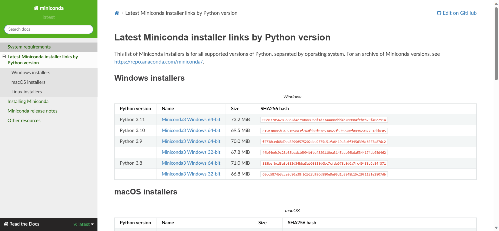

+ ***还在更新中~~~***

在第二章 Python 基础架构中主要有四个部分：包管理器conda， 虚拟环境 conda， Docker容器， 云实例。

## 引言

在介绍conda之前，我们再介绍一下Pyhton。

在大家刚开始学习 Python的时候，一定会学到 “Python是一门解释型的语言”。

首先，什么是解释型语言呢，编程语言其实可以分为两大类：

+ 编译型
+ 解释型。

编译型语言有C、C++等等，编译型语言的特点是：**一次编译、永久运行**。因为我们编写的源代码都是计算机无法识别的高级语言，因此通过编译过程，将源代码翻译成机器码，然后就可以直接运行，特点就是**运行效率高，速度快**。

而解释型语言比如 Basic 语言，它的特点是**边运行边解释**，每执行一次都要翻译一次，因此**效率比较低**。

那为什么刚才的解释型语言我们举了 Basic 语言的例子但是没有说大家最熟悉的Python呢？事实上，随着越来越多语言的出现，语言的类型早就不止这两种了，我们一般说是解释型语言的Python，实际上并不是一种纯解释的语言，而是一种“编译解释语言”，即**先编译、后解释**。

Python的编译过程和C、C++的编译不同。一方面，Python是通常是逐模块（逐文件）编译的，而不是编译整个源代码，当导入一个模块或软件包时，Python会编译该模块或软件包的源代码，并将其存储在`.pyc`文件中，而并不是编译所有的源代码；另一方面，Python编译结果是*字节码*而不是*机器码*。

而在Python程序运行时，它会同时对未编译的源代码和编译后的机器码进行逐行解释并运行。

那么为什么Python的运行过程这么怪呢，事实上对于标准Python，它是完全通过解释运行的，但是标准Python只带有标准库，如基础的数学库，输入输出等。各种功能强大的软件包必须独立安装，比如 web 相关的 `django`、`flask`，数学相关的 `numpy`，人工智能相关的 `pytorch` ...... 

而正因为有大量的软件包，并且不同软件包：

+ 下载方式不同
+ 编译、构建条件不同
+ 相关依赖不同
+ 版本众多

因此，我们必须要有一个工具来管理这些软件包，软件包管理工具应运而生~

## 软件包管理器

事实上，对于初学 Python的同学，大家接触到的第一个包管理器必然是 `pip` 而不是 `conda` ，因此，我们先来看看 `pip` 。

### pip 包管理器

`pip` 的主要目的是帮助Python开发者轻松管理项目所需的依赖项。通过`pip`，可以方便地安装第三方Python库、工具和应用程序。

#### 特点

+ 官方包仓库：pip 默认使用Python Package Index（PyPI）作为官方包仓库。PyPI是一个庞大的Python软件包存储库，包含了成千上万的Python软件包，涵盖了各种领域，从Web开发到数据科学和机器学习。

+ 简单的命令：`pip` 提供了一组简单而直观的命令。

+ 自动依赖解决：`pip` 能够自动解决软件包之间的依赖关系。

+ 虚拟环境支持：虽然 `pip` 本身不提供虚拟环境管理功能，但通常与 virtualenv 或 venv 结合使用，以创建和管理独立的Python虚拟环境。

+ 版本控制：`pip` 允许您安装特定版本的软件包，可以确保依赖关系

+ 升级和卸载：`pip` 不仅可以用于安装软件包，还可以升级和卸载软件包。

+ 社区支持：`pip` 是Python社区的一部分，受到广泛的支持和使用。这意味着有大量的文档、教程和社区资源可供参考和求助。

#### 使用

Python的安装包中带有 `pip`，因此在安装 Python 后，我们可以直接使用 `pip` 进行软件包的管理，几条常用命令如下：

1. 安装包

```shell
pip install package_name==version
```

+ `package_name`：要安装的软件包名称。
+ `version`（可选）：要安装的特定版本号。

pip install matplotlib==3.4.1

2. 升级包

```shell
pip install --upgrade package_name
```

+ `package_name`：要升级的软件包名称。

3. 卸载包

```shell
pip uninstall package_name
```

+ `search_term`（可选）：要搜索的关键字。

4. 搜索包

```shell
pip search search_term
```

- `search_term`（可选）：要搜索的关键字。

5. 列出已安装的包

```shell
pip list
```

6. 查看软件包信息：


```shell
pip show package_name
```

+ `package_name`：要查看信息的软件包名称。

7. 安装依赖项文件

```shell
pip install -r requirements.txt
```

+ `requirements.txt`：包含依赖项列表的文本文件。

```shell
# requirements.txt
asgiref==3.5.2
channels==3.0.2
Django==4.1
html2text==2020.1.16
Markdown==3.4.4
numpy==1.25.2
pdfkit==1.0.0
PyJWT==2.8.0
PyJWT==2.8.0
PyMySQL==1.1.0
pypandoc==1.11
python_docx==0.8.11
```

8. 更换下载源

由于一些众所周知的原因，直接用 `pip` 连接官方仓库经常卡的一批，这个时候我们可以使用国内镜像源（如清华镜像源等）来下载~

```shell
#临时更换
pip install -i https://pypi.tuna.tsinghua.edu.cn/simple package_name
```

+ `package_name` 为包名

如果要永久更换，就需要更改 `pip` 的配置文件 `pip.ini` 或者 `pip.conf` ，文件路径如下：

```shell
# windows
C:\Users\YourUserName\pip\pip.ini

# macOS
~/Library/Application Support/pip/pip.conf

# linux
~/.pip/pip.conf
```

打开文件后加入如下内容：

```ini
[global]
index-url = https://pypi.tuna.tsinghua.edu.cn/simple/
```

### Conda 包管理器

`conda` 、 MiniConda 、 Anaconda 他们之间到底有什么关系呢？

和 `pip` 一样， `conda`是一个包管理工具，`pip`有的功能，`conda`都有。并且：

- 它可以用于管理任何编程语言的软件包，不仅仅是Python
- `conda` 本身并不包含任何软件包，但可以用于安装其他软件包。
- `conda` 支持虚拟环境，可以创建独立的Python环境，以隔离不同项目的依赖关系。

而 MiniConda 、 Anaconda 则是 `conda` 的不同发行版本。

`Miniconda` 是一个最小化的`conda`发行版，它只包含了`conda`本身和一些基本的库和依赖项，没有任何其他附加的软件包，特点是 **轻量**。

`Anaconda` 是一个**完整**的数据科学和科学计算发行版，它包含了大量的Python软件包、库和工具，用于数据分析、机器学习、科学计算等领域。

与Miniconda相比，Anaconda更大、更全面，并且包括了众多数据科学工具，它占用的硬盘也很恐怖，截至写作为止，`Anaconda`四个虚拟环境占用了我笔记本25G硬盘，而服务器上的 `Miniconda` 两个环境只占了 956MB 硬盘 (#_<-)

#### Miniconda 安装

首先在命令行中输入 `Python -V` 查看当前 `python` 环境版本。

接下进入 `Miniconda` 的[官网]([Miniconda — miniconda documentation](https://docs.conda.io/projects/miniconda/en/latest/))，找到对应 `python` 环境版本和操作系统版本并下载。



把文件传输到服务器或者下载到自己的电脑，打开安装文件的文件目录（如果是服务器则 `cd` 到对应文件目录）

+ Windows 直接双击 `.exe` 文件
+ MacOS 直接双击 `.pkg` 文件
+ Linux则运行命令 `bash filename` 

接下来只要跟着指引一路确认或者回车即可安装成功 (´▽`ʃ♡ƪ)

安装完成后运行 `conda list` 命令即可查看虚拟环境（一开始应该只要有 `base` 环境） 

#### Anaconda 安装
