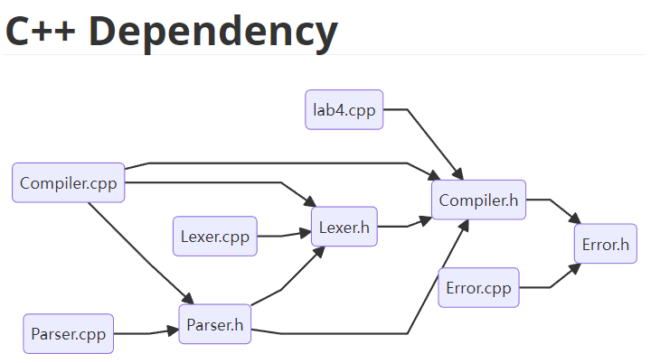

# Tools

[工具地址](https://github.com/Cx330-502/Tools/tree/schedule) 仓库的其他分支还有更多工具哦~

## cpp_dependency

这是一个分析 CPP 头文件依赖的脚本，妈妈再也不用担心我的头文件循环依赖啦！

#### 使用说明

```shell
python cpp_dependency.py
```

直接运行 python 脚本即可。

需要选择分析文件和输出文件的目录


接下来即可正常运行

依赖关系会被输出到输出文件夹下的 `cpp_dependency.md` 文件，需要 mermaid 插件才能正常查看。


