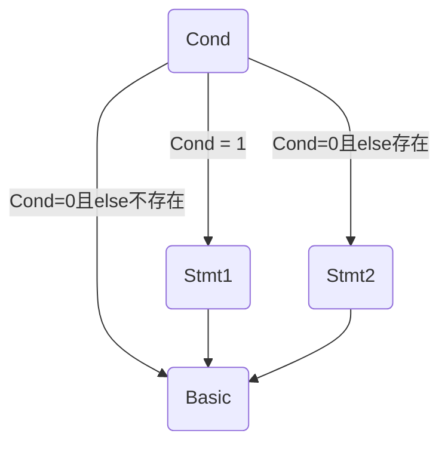
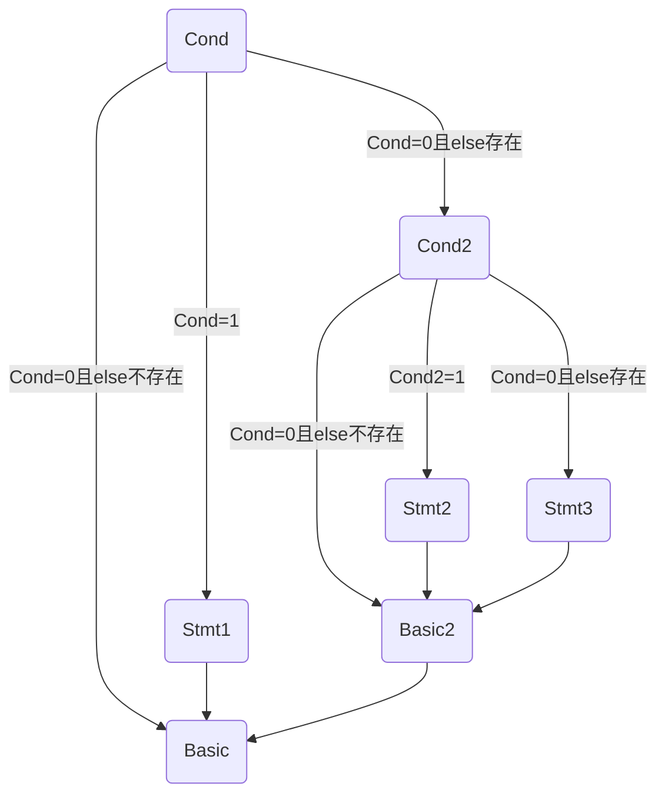
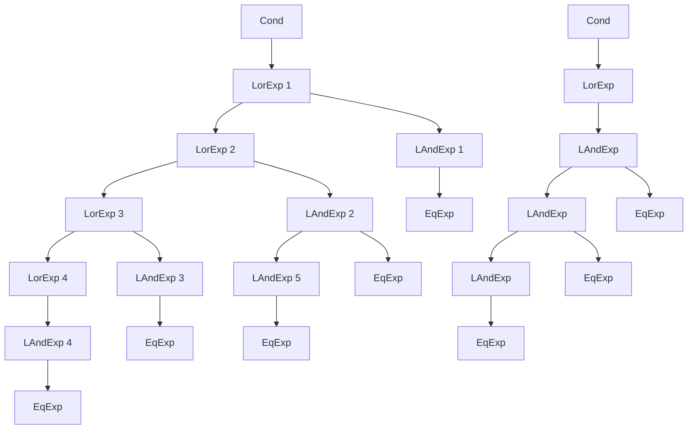

跳转感觉是整个 LLVM 中间代码生成中最难的一部分了，总共三个小部分 `if` 跳转、`cond` 跳转、 `for` 跳转，其中又以 `cond` 跳转最难，接下来按照顺序分析每个部分。

### if 跳转

在 SysY 中，`if` 语句文法如下：1

```shell
'if' '(' Cond ')' Stmt [ 'else' Stmt ]
```

用图表表示如下：



也就是这里的跳转有如下几种情况：

+ `if` 条件为真时，跳转到 `Stmt1`
+ `if` 条件为假且 `else` 存在时，跳转到 `Stmt2`
+ `if` 条件为假且 `else` 不存在时，跳转到 `Basic` （即下一条正常语句）
+ `Stmt2` 执行结束跳转到 `Basic` 
+ `Stmt1` 执行结束跳转到 `Basic` 

从跳转的目标来看，这里需要三个 `label` 分别指向  `Stmt1` 、 `Stmt2` 、 `Basic` 。

这里出现了第一个**坑**，如果在前面的代码生成中都使用了数字作为虚拟寄存器代号，那么我**强烈建议**改成用字符串编号。为什么呢？

在按照顺序对 `if` 语句进行代码生成时，按照有 `else` 的情况，那么就需要在 `Stmt1` 的结尾和 `Stmt2` 的结尾分别跳转到 `Basic` 块。

+ 如果等 `Stmt1` 和 `Stmt2` 完全生成结束了才开始开始对 `Basic` 开始编号，那么 `Stmt1` 的结尾和 `Stmt2` 的结尾处的跳转语句就无从处理
+ 而如果先决定下来了 `Basic` 的编号，按照虚拟寄存器数字代号的要求，label 的顺序必须按照数字的顺序，也就是说很可能需要先生成 `Basic` 块的代码，再去处理 `Stmt1` 和 `Stmt2` ，这显然过于繁琐。

因此**强烈建议**改成用字符串编号，其实很好改，在编号前面加个字母就好了（doge）。

至于 `if` 跳转的代码怎么生成，其实是非常简单的，按照源代码按顺序生成 LLVM 代码即可：

```cpp
int stmt1_label = curReg++;
int stmt2_label = curReg++;
int basic_label = curReg++;
if(存在else){
    cout<<br i1 %cond label stmt1_label, label stmt2_label<<endl；
}else{
    cout<<br i1 %cond label stmt1_label, label basic_label<<endl；
}
//处理Stmt1
cout<<endl<<stmt1_label:<<endl；
generate_stmt1;
cout<<br label basic_label<<endl;
//处理else
if(存在else){
	cout<<endl<<stmt2_label:<<endl；
	generate_stmt2;
	cout<<br label basic_label<<endl;
}

cout<<endl<<basic_label:<<endl
//生成接下来的代码
```

当然啦，可能会有人疑惑，这不是只解决了一层的 `if` 吗，多层嵌套呢？

其实是一样的~~~



跳转到 `Basic` 的语句最终会被添加到 `Basic2` 的末尾，而跳转到 `Basic2` 的语句则会根据之前的程序被添加到每个分支的末尾。

因此，上面的伪代码就已经很好的解决了 `if` 所有的跳转问题，但是难点短路求值还没开始呢😏😏😏。

### 短路求值

#### 基本

上面并没有直接的讨论 `if` 的判断条件 `Cond` 。事实上，根据语法树对 `Cond` 求值并不难，甚至和常量表达式一样非常简单，但是烦就烦在短路求值：

```cpp
int num = 0;
if ( 1 || num++){
    std::cout<< num << std::endl;
}
```

此处输出的 `num` 值是多少呢？但凡有点基础的都知道是 0 ，因为当条件语句的一部分已经能够确定整体值的时候，就不会再去计算剩下的部分。

从理论上来说，这个短路求值的操作是为了提升性能，毕竟能少算一部分。~~那么从理论上来说，我不要这部分性能直接全算不就行了嘛。怎么会有人在条件语句里改变值啊淦~~

所以，出于我们提高性能的伟大目的，让我们来看一看这个短路求值。

首先，短路求值的跳转目标是什么呢？

并不是直接跳转回去赋值，而是**直接跳转进入对应的基本块**。

例如上述代码，条件语句检测到 1 后，应该是跳转直接执行输出语句，而不是先跳转到 `Cond` 语法树的顶端，将它赋值为 1 后再进行判断再跳转。

那么，我们应该如何在分析 `Cond` 的函数中用到之前 `if` 语句的 label 编号呢，第一种方法是函数传值，但是这样很有可能需要改写很多之前写完的函数，我懒得再改了；第二种方法就是用全局变量，把这三个 label 都存起来，只要需要用随时可以读取。

了解了跳转目标后，我们再来看一下 `Cond` 相关的文法：

```shell
Cond    → LOrExp
LOrExp  → LAndExp | LOrExp '||' LAndExp 
LAndExp → EqExp | LAndExp '&&' EqExp
EqExp   → RelExp | EqExp ('==' | '!=') RelExp
RelExp  → AddExp | RelExp ('<' | '>' | '<=' | '>=') AddExp
```

事实上所有的跳转必然发生在 `LOrExp` 和 `LAndExp` 节点的子节点计算完成后。我们先画出这文法的语法树：



这两个语法树中就已经包含了前三条文法的几乎所有情况。

首先来看左边的这棵语法树，

可以看到，所有的 `LOrExp` 都出现在左节点，基于或运算的特性，我们得到了短路求值中的第一种跳转：任一 `LOrExp` 为 True 后即可直接跳转至 `if` 语句的 `Stmt1` 语句。

同样基于或运算的特性，第二种跳转为：任一父节点为 `LOrExp` 的 `LAndExp` 节点为 True 后即可直接跳转至 `if` 语句的 `Stmt1` 语句。

基于前两条跳转，我们得到第三种跳转，任一 `LAndExp` 节点若为 false ，则可直接跳转至与之最接近的父 ` LOrExp` 节点的父节点并进入其右子树。

这就是左边这种语法树的所有跳转情况：

+ 任一 `LOrExp` 为 True 后即可直接跳转至 `if` 语句的 `Stmt1` 语句。
+ 任一父节点为 `LOrExp` 的 `LAndExp` 节点为 True 后即可直接跳转至 `if` 语句的 `Stmt1` 语句。
+ 任一 `LAndExp` 节点若为 false ，则可直接跳转至与之最接近的父 ` LOrExp` 节点的父节点并进入其右子树。

第三种情况这么说可能很抽象啊，我们来结合图像讲一下，比如说 `LAndExp 5` 这个节点，首先如果程序进入了这个节点，那么我们就可以确定 `LOrExp 5` 及其子树必然是 false ， `LOrExp 2` 的值只由 `LAndExp 2` 决定。

若 `LAndExp 5` 为 false ，那么基于与运算的特性， `LAndExp 2` 必为 false， `LOrExp 2` 也如此，那么我们就可以直接去处理 `LOrExp 1` 的右子树了。

所以 `LOrExp 1` 就是与 `LAndExp 5` 最接近的父 ` LOrExp` 节点的父节点。

那么怎么跳到这个位置呢？

首先需要明确一点，我们已经覆盖了左边语法树的所有跳转情况，除去直接跳转出 `Cond` 的两种，跳转目标其实是所有 `LOrExp` 节点的右子树（除了 `LOrExp4` 这种只有一个子节点的）

要存下这么多的跳转目标，最好的结构自然是栈，伪代码如下：

```cpp
// 以下是对 LOrExp 节点的分析
int LorExp_label = curReg++;
stack.push(LorExp_label);
generate_左子树();//生成左子树相关的中间代码
//如果左子树为1，则直接跳转到Stmt1
cout << br i1 左子树.value label Stmt1,  label LorExp_label << endl;
cout << LorExp_label: << endl;
generate_右子树();//生成右子树相关的中间代码
stack.pop();
//如果右子树为1，则直接跳转到Stmt1
//如果右子树为0，则直接跳转到父节点的右子树（LOrExp节点不可能为左子树）
cout << br i1 右子树.value label Stmt1,  label stack.top() << endl;
return_to_父节点；
```

可能已经有人发现了问题，**与当前节点最接近的父 ` LOrExp` 节点的父节点**，那么如果是 `LAndExp 1` 呢？它父节点的父节点可就是 `Cond` 了，这怎么跳转？

实际上 `LAndExp 1` 这边的子树一旦值为 flase ， 则将立刻跳转进入 `if` 语句的 `Stmt2` 语句或 `Basic` 语句，那么在程序中如何实现呢？其实只要在进入 `Cond` 时将 `Stmt2` 语句或 `Basic` 语句压入其中即可， `LAndExp 1` 这边的子树一旦值为 flase ，则栈中父节点的父节点对应的 label 即为 `Stmt2` 语句或 `Basic` 语句。

从数据结构的角度来说则是， `Stmt2` 语句或 `Basic` 语句始终在栈底。在本程序中，我们需要寻找的不是栈顶元素，而是第二高的栈顶元素，当在左子树时，栈内元素必然大于等于三（ `Stmt2` 语句或 `Basic` 语句、LorExp 1 、LorExp 2），正常存取即可；而一旦进入右子树，栈内元素数量必然等于2，此时一旦出现 false ，则将取栈内第二高的元素，即为 `Stmt2` 语句或 `Basic` 语句。

因此对 `LAndExp` 节点，伪代码如下：

```cpp
generate_左子树();//生成左子树相关的中间代码
int temp = stack.top();
stack.pop();//不需要直接父 LOrExp节点
cout<<br i1 左子树.value label LAndExp, label stack.top()<<endl;
stack.push(temp);
cout<<LAndExp:<<endl;
generate_右子树();
return_to_父节点；
```

对于右边的子树，其实它完美符合左子树的第三条规则，就不再赘述了😏😏😏

#### 坑

在短路求值中一个比较坑的点时， `br` 条件跳转后面接的值类型为 `i1` ，而 `RelExp` 中可能有 `i32` 的值。由于所有的跳转都发生在 `LAndExp` 和 `LOrExp` 两种，因此我们要保证值从 `EqExp` 返回到 `LAndExp` 时为 `i1` 。

这里懒得画语法树了，直接看文法吧：

```shell
EqExp   → RelExp | EqExp ('==' | '!=') RelExp
RelExp  → AddExp | RelExp ('<' | '>' | '<=' | '>=') AddExp
```

首先，对于 `RelExp` ，它的值有两种可能 `i1` 和 `i32` ，其实很好区分，只有一个子节点的是 `i32` ，有两个子节点（只考虑非终结符）的是 `i1` ，但是又可能有 ` 1 < 3 > 1 ` 这种鬼畜表达式，从语法树上来看，先计算 `1 < 3` 得到 `i1` 的 1 ，接下来应该把 `i1` 升为 `i32` ，再计算 `1 > 3 ` 得到 `i1` 的 0 。

所以我们得出结论，对于有两个子节点的 `RelExp` 应当先将 `i1` 升为 `i32` 再向上传递。

这样，我们就能保证 `EqExp` 的子节点 `RelExp` 必为 `i32`。接下来与 `RelExp` 类似，但需要注意的是，转换 `EqExp` 类型前应先检查其父节点的类型，若为 `EqExp` 则应该转化为 `i32` ，若为 `LAndExp` 则应该转化为 `i1` 。
